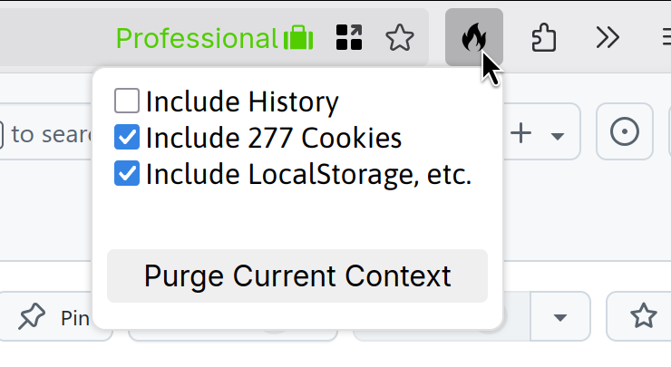
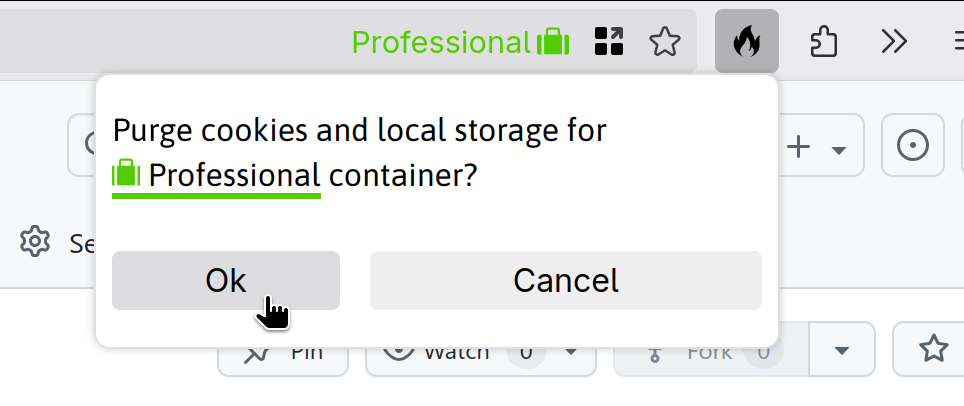

# Firefox Container Purge

Extension to purge cookies, local storage, and history from individual Firefox Container Tabs.

This extension is currently unlisted from the Mozilla Addons site due to its very niche usage.

## Screenshots

